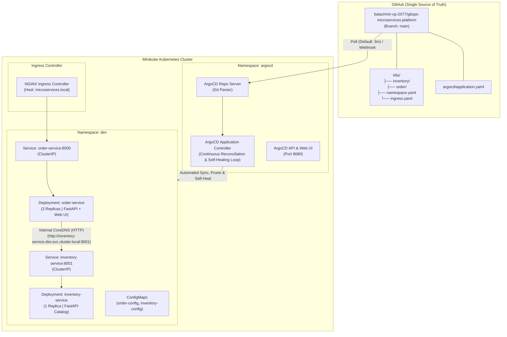

# GitOps Microservices Platform

[](https://kubernetes.io/)
[](https://minikube.sigs.k8s.io/)
[](https://argo-cd.readthedocs.io/)
[](https://www.docker.com/)
[](https://fastapi.tiangolo.com/)
[](LICENSE)

A production-grade, declarative GitOps continuous delivery pipeline running on **Minikube** and automated using **ArgoCD**. This project delivers a cloud-native, multi-tier microservices platform demonstrating automated synchronization, drift detection, self-healing, zero-downtime rolling updates, and internal Kubernetes service discovery.

---

## 📑 Table of Contents

- [Overview](#overview)
- [Architecture](#architecture)
- [Microservices Breakdown](#microservices-breakdown)
- [GitOps Workflow & Principles](#gitops-workflow--principles)
- [Repository Structure](#repository-structure)
- [Getting Started](#getting-started)
  - [Prerequisites](#prerequisites)
  - [1. Cluster Provisioning](#1-cluster-provisioning)
  - [2. Build & Load Container Images](#2-build--load-container-images)
  - [3. Install & Access ArgoCD](#3-install--access-argocd)
  - [4. Deploy the GitOps Application](#4-deploy-the-gitops-application)
  - [5. Access the Services](#5-access-the-services)
- [Day-2 Operations & Validation](#day-2-operations--validation)
  - [Scenario 1: Cluster Drift & Automated Self-Healing](#scenario-1-cluster-drift--automated-self-healing)
  - [Scenario 2: Declarative Release via Git](#scenario-2-declarative-release-via-git)
- [Security & Production Best Practices](#security--production-best-practices)
- [Author](#author)

---

## 🔍 Overview

Traditional CI/CD pipelines push changes imperatively to clusters using privileged credentials stored in external runners. This pattern frequently suffers from **configuration drift** when manual out-of-band updates occur directly in the cluster.

This project implements the **Pull-based GitOps Pattern**:
- **Git as the Single Source of Truth**: All infrastructure and application configurations are stored declaratively in this repository.
- **In-Cluster Reconciliation**: ArgoCD continuously compares the desired state in Git against the live cluster state.
- **Automated Anti-Drift**: Any out-of-band manual changes (`kubectl edit`, `kubectl scale`, accidental deletions) are automatically detected and self-healed.
- **Auditability & Traceability**: Every deployment, scaling event, and configuration tweak is tracked as an immutable Git commit.

---

## 🏛️ Architecture



---

## 📦 Microservices Breakdown

| Service | Technology | Internal Port | In-Cluster DNS | Description |
|---|---|---|---|---|
| **`order-service`** | Python 3.12, FastAPI, Uvicorn, HTTPX | `8000` | `order-service.dev.svc.cluster.local:8000` | Web status dashboard and order management API. Queries `inventory-service` asynchronously to validate stock before processing orders. |
| **`inventory-service`** | Python 3.13, FastAPI, Uvicorn | `8001` | `inventory-service.dev.svc.cluster.local:8001` | Backend product catalog and stock inventory REST API with health endpoints. |

### Key Endpoints
- **Order Service**:
  - `GET /`: Interactive web status dashboard showing live service telemetry and backend inventory connectivity.
  - `GET /healthz`: Kubernetes liveness and readiness probe endpoint.
  - `GET /api/v1/orders`: List all placed customer orders.
  - `POST /api/v1/orders`: Create a new order (validates price and stock with `inventory-service`).
- **Inventory Service**:
  - `GET /healthz`: Liveness and readiness probe endpoint.
  - `GET /api/v1/items`: List all items in the catalog.
  - `GET /api/v1/items/{item_id}`: Query item price and available quantity.

---

## 🔄 GitOps Workflow & Principles

The ArgoCD `Application` Custom Resource (`argoproj.io/v1alpha1`) governs the lifecycle of all manifests under [`k8s/`](./k8s/):

```yaml
apiVersion: argoproj.io/v1alpha1
kind: Application
metadata:
  name: microservices-platform
  namespace: argocd
spec:
  project: default
  source:
    repoURL: https://github.com/balachmir-cp-2077/gitops-microservices-platform.git
    path: k8s
    targetRevision: HEAD
    directory:
      recurse: true
  destination:
    server: https://kubernetes.default.svc
    namespace: dev
  syncPolicy:
    automated:
      prune: true
      selfHeal: true
    syncOptions:
      - CreateNamespace=true
```

- **`directory.recurse: true`**: Automatically traverses child manifest folders (`k8s/order`, `k8s/inventory`).
- **`prune: true`**: When a manifest is deleted from Git, ArgoCD automatically prunes the corresponding resource in Kubernetes to avoid abandoned "orphan" workloads.
- **`selfHeal: true`**: Actively remediates any configuration drift caused by manual `kubectl` intervention.

---

## 📂 Repository Structure

```text
gitops-microservices-platform/
├── .github/                         # GitHub repository configuration
├── argocd/
│   └── application.yaml             # ArgoCD Application Custom Resource (GitOps engine)
├── k8s/
│   ├── namespace.yaml               # Target environment namespace ('dev')
│   ├── ingress.yaml                 # NGINX Ingress routing rule (microservices.local)
│   ├── inventory/                   # Inventory microservice manifests
│   │   ├── configmap.yaml           # Runtime configuration & ports
│   │   ├── deployment.yaml          # Pod spec, probes, securityContext & resources
│   │   └── service.yaml             # ClusterIP service definition
│   └── order/                       # Order microservice manifests
│       ├── configmap.yaml           # Environment variables & backend URLs
│       ├── deployment.yaml          # Multi-replica pod spec
│       └── service.yaml             # ClusterIP service definition
├── services/
│   ├── inventory-service/           # Inventory backend service source
│   │   ├── .dockerignore
│   │   ├── Dockerfile               # Multi-layer, non-root container definition
│   │   ├── app.py                   # FastAPI application logic
│   │   └── requirements.txt         # Pinned Python dependencies
│   └── order-service/               # Order frontend/API service source
│       ├── .dockerignore
│       ├── Dockerfile               # Multi-layer, non-root container definition
│       ├── app.py                   # FastAPI + Web UI + HTTPX client
│       └── requirements.txt         # Pinned Python dependencies
└── README.md                        # Documentation & portfolio overview
```

---

## 🚀 Getting Started

### Prerequisites

- [Docker](https://docs.docker.com/engine/install/) (v20.10+)
- [Minikube](https://minikube.sigs.k8s.io/docs/start/) (v1.30+)
- [kubectl](https://kubernetes.io/docs/tasks/tools/) (v1.28+)
- [git](https://git-scm.com/)

---

### 1. Cluster Provisioning

Start a local Minikube cluster and enable the NGINX Ingress controller addon:

```bash
minikube start --driver=docker --cpus=2 --memory=4096
minikube addons enable ingress
```

Verify that the node is ready:

```bash
kubectl get nodes -o wide
```

---

### 2. Build & Load Container Images

Build the production-grade images locally on your host:

```bash
docker build -t inventory-service:v1.0.0 ./services/inventory-service
docker build -t order-service:v1.0.0 ./services/order-service
```

Load the images directly into Minikube's container runtime cache:

```bash
minikube image load inventory-service:v1.0.0
minikube image load order-service:v1.0.0
```

Verify the images exist inside Minikube:

```bash
minikube image ls | grep -E "order-service|inventory-service"
```

---

### 3. Install & Access ArgoCD

Create the `argocd` namespace and deploy the official ArgoCD manifests:

```bash
kubectl create namespace argocd
kubectl apply -n argocd -f https://raw.githubusercontent.com/argoproj/argo-cd/stable/manifests/install.yaml
```

Wait until all ArgoCD control plane components are running:

```bash
kubectl wait --for=condition=available deployment -l app.kubernetes.io/name=argocd-server -n argocd --timeout=300s
```

Forward the ArgoCD Web UI to localhost:

```bash
kubectl port-forward svc/argocd-server -n argocd 8080:443
```

Extract the initial admin password:

```bash
kubectl -n argocd get secret argocd-initial-admin-secret -o jsonpath="{.data.password}" | base64 -d; echo
```

- **URL**: `https://localhost:8080`
- **Username**: `admin`
- **Password**: `<output from above command>`

---

### 4. Deploy the GitOps Application

Apply the ArgoCD `Application` Custom Resource:

```bash
kubectl apply -f argocd/application.yaml
```

Monitor ArgoCD syncing the cluster resources to match Git:

```bash
kubectl get application -n argocd
```

Output:
```text
NAME                     SYNC STATUS   HEALTH STATUS   REVISION   PROJECT
microservices-platform   Synced        Healthy         HEAD       default
```

---

### 5. Access the Services

Add the local domain to your `/etc/hosts` file:

```bash
echo "$(minikube ip) microservices.local" | sudo tee -a /etc/hosts
```

Open your browser and navigate to:
```text
http://microservices.local
```

Or test via `curl`:

```bash
# Verify Web Dashboard
curl -H "Host: microservices.local" http://$(minikube ip)/

# Create an order via API
curl -X POST http://microservices.local/api/v1/orders \
  -H "Host: microservices.local" \
  -H "Content-Type: application/json" \
  -d '{"item_id": "item-101", "quantity": 1}'
```

---

## 🛡️ Day-2 Operations & Validation

### Scenario 1: Cluster Drift & Automated Self-Healing

Simulate an accidental manual deletion or emergency tampering in the live cluster:

```bash
# Imperatively scale down the order service to 0 replicas
kubectl scale deployment/order-service -n dev --replicas=0
```

Watch how ArgoCD detects the discrepancy and automatically reconciles:

```bash
kubectl get events -n dev --sort-by='.metadata.creationTimestamp' | tail -n 10
```

> **Result**: ArgoCD's `application-controller` detects that the live replica count (`0`) does not match the desired Git state (`3`), instantly overrides the change, and re-provisions all pods.

---

### Scenario 2: Declarative Release via Git

To deploy an update or scale workloads, engineers never use `kubectl apply`. All changes flow through version control:

1. Update `replicas: 3` in [`k8s/order/deployment.yaml`](./k8s/order/deployment.yaml).
2. Commit and push:
   ```bash
   git commit -am "feat: scale order-service to 3 replicas for high availability"
   git push origin main
   ```
3. ArgoCD polls the repository, detects the commit SHA, and triggers a rolling update:
   ```bash
   kubectl get pods -n dev
   ```

---

## 🔒 Security & Production Best Practices

- **Non-Root Containers**: Both services run under an explicit non-root user (`appuser`, UID: `1000`, GID: `1000`). Root privileges are dropped at build time.
- **Resource Governance**: Every container defines strict CPU and memory `requests` (for scheduling guarantees) and `limits` (preventing noisy neighbor exhaustion and runaway memory leaks).
- **Graceful Lifecycle & Health Probes**: Configured with `readinessProbe` (removing unready pods from endpoints) and `livenessProbe` (automatic container restart on deadlocks) on `/healthz`.
- **Network Isolation**: Backend microservices communicate strictly over internal cluster DNS (`ClusterIP`) without public exposure. Only the frontend is exposed via Ingress.
- **Build Efficiency**: Layer-optimized Dockerfiles with `requirements.txt` installed before source copying, ensuring fast CI builds.

---

## 👤 Author

**Mir Balach**  
- GitHub: [@balachmir-cp-2077](https://github.com/balachmir-cp-2077)  
- Repository: [gitops-microservices-platform](https://github.com/balachmir-cp-2077/gitops-microservices-platform)
